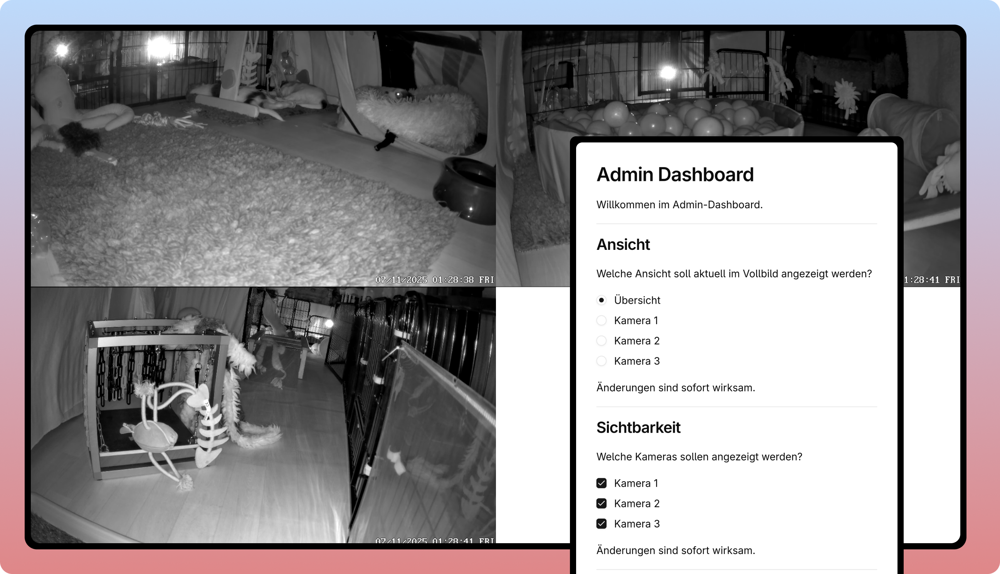

# Welpen Online

A monorepo containing a Next.js client and Deno server for a livestream application. An administrator can decide which streams to show/maximize on the big screen, for example a TV in a convention hall.



Noteworthy technologies this project uses are:

## Project Structure

```
.
├── types/              # Source of truth for shared types
├── client/             # Next.js frontend (standalone)
│   └── types/          # Synced copy of types
├── server/             # Deno backend (standalone)
│   └── types/          # Synced copy of types
└── .husky/             # Git hooks for automatic type syncing
```

## Quick Start

### Install Dependencies

```bash
# Root dependencies (includes husky for git hooks)
pnpm install

# Client dependencies
cd client && pnpm install
```

### Development

**Client:**

```bash
cd client
pnpm dev
```

**Server:**

```bash
cd server
deno task dev
```

### Building

```bash
# From root - syncs types and builds client
pnpm build

# Or build client directly
cd client && pnpm build
```

## Types Management

This project uses a unique approach to handle shared types:

- **Source of truth:** `/types/`
- **Automatic sync:** Pre-commit hook copies to `client/types/` and `server/types/`
- **Standalone operation:** Each directory can be deployed independently

**Workflow:**

1. Edit types in `/types/` only
2. Commit your changes
3. Pre-commit hook automatically syncs and stages the copies

See [TYPES_SYNC.md](TYPES_SYNC.md) for details.

## Deployment

Both client and server are standalone and can be deployed independently:

- **Client:** Deploy to Vercel (see [DEPLOYMENT.md](DEPLOYMENT.md))
- **Server:** Deploy to Deno Deploy or similar platforms

## Documentation

- [DEPLOYMENT.md](DEPLOYMENT.md) - Deployment guide
- `client/.env.example` - Client environment variables
- `server/.env.example` - Server environment variables
